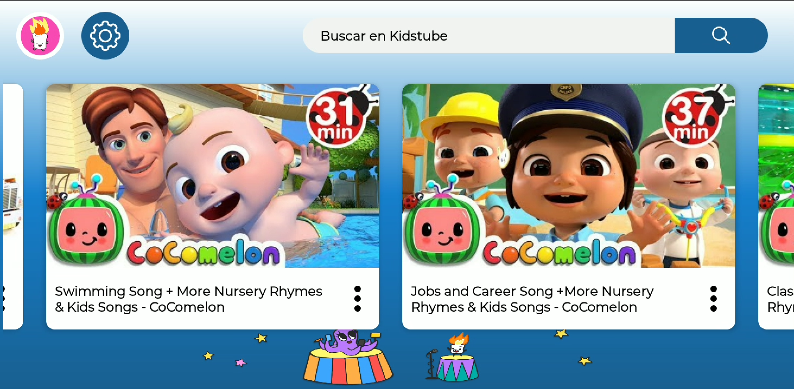
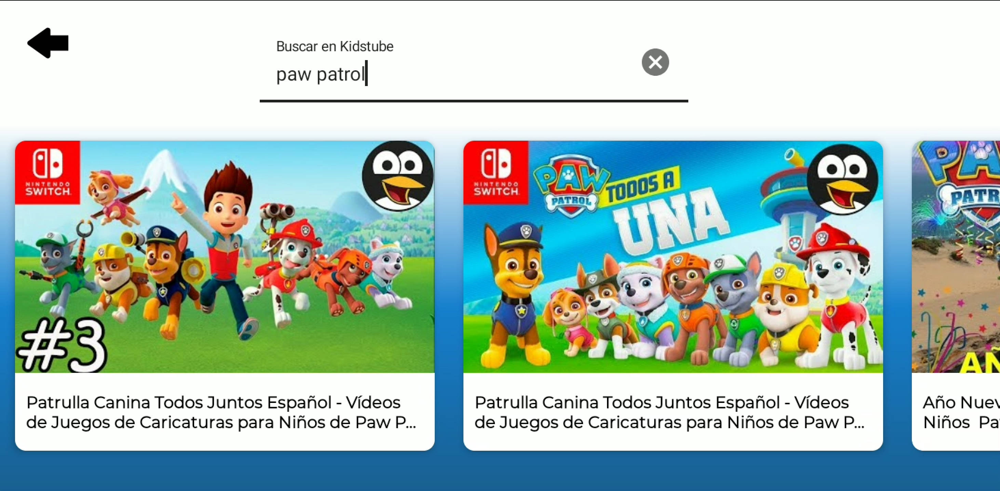
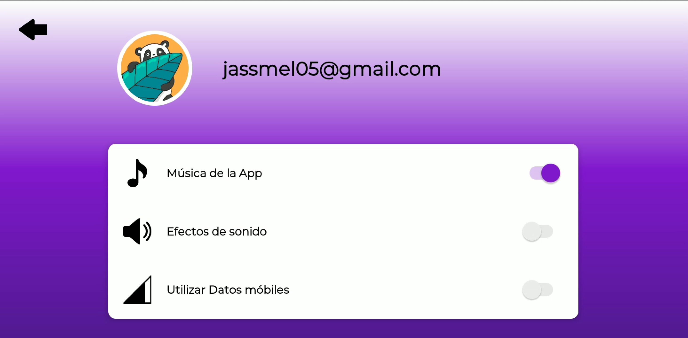
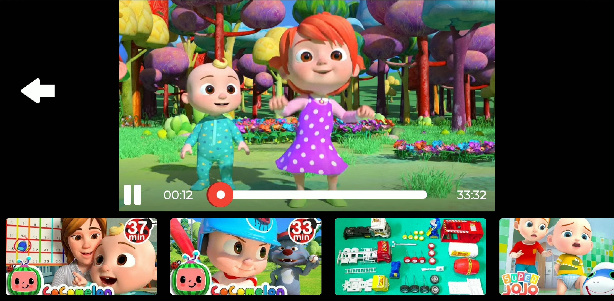
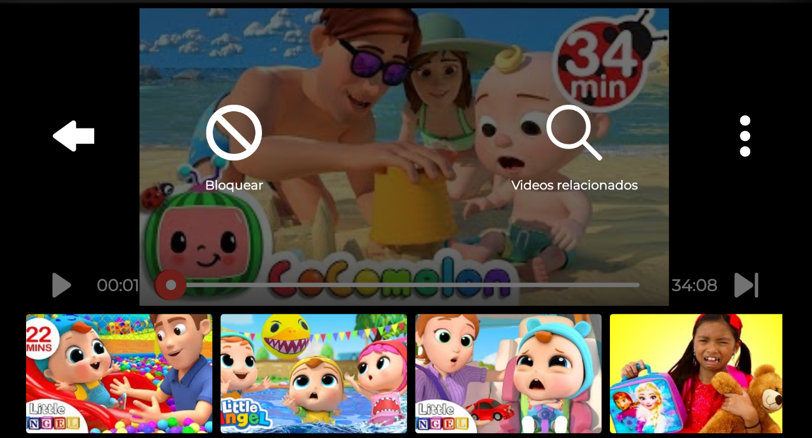

# Kidsbe
Esta es una aplicación simple, similar a YoutubeKids, pero con funcionalidades extras.

En el Dashboard se muestra una lista de videos relacionados al último video reproducido.

Se pueden buscar todo tipo de videos, pero además se realiza un match con "videos para niños".

Aunque salta por configurar, estas serían las configuraciones principales.
Falta por agregar los efectos de sonido para loc clicks y los swipe en las listas, además de realizar los request dependiendo de la opción de "Utilizar Datos móbiles".

En esta parte se puede seleccionar un Avatar diferente.

Se utiliza iFrame, de Youtube para reproducir los videos.
En esta parte se puede seleccionar entre los demás videos antes obtenidos del dashboard o de la búsqueda.

